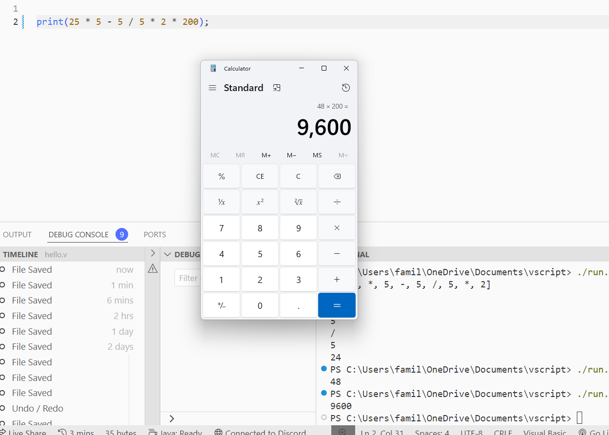
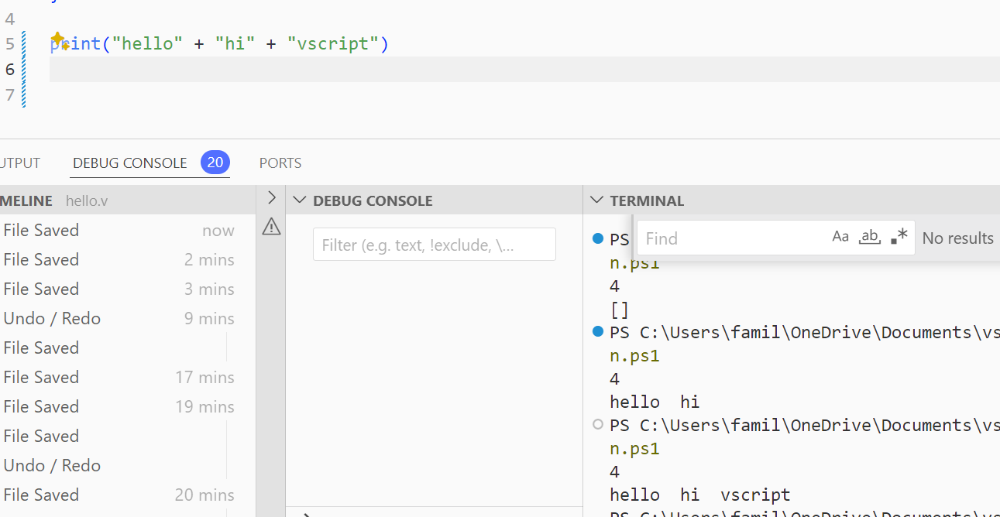
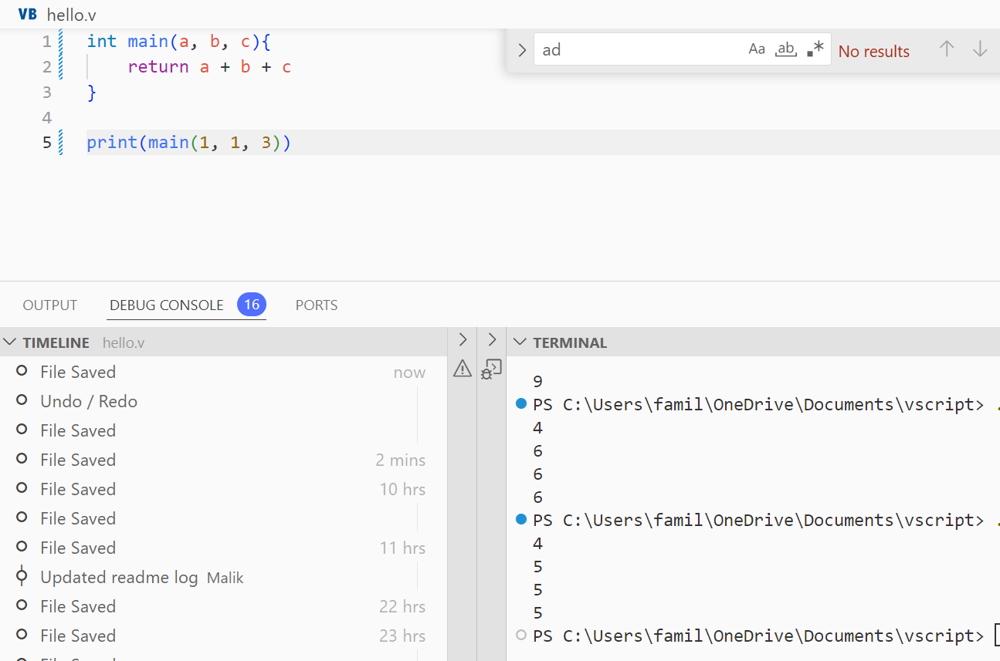
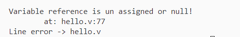
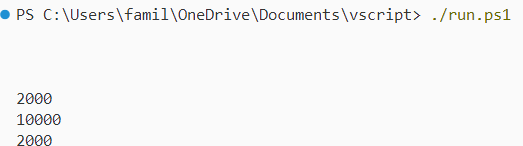

# VSCRIPT


What is vscript?
- A staticaly typed language built ontop of java
- A project aimed to improve skillset
- A simple language


Beginner dev?

1. What will i gain reading through the code?
 - You will be able to understand how lexers work - proper usage of Abstract Syntax Tree's (AST);
 - You will be able to understand 
    - string manipulation 
    - Arrays
    - Loops
    - Common lexing lookaheads char indexing;
    - ArrayLists
    - Type checking / string parsing
    - Lexical logic


# TODO LOG
-  Improve printing values , currently we cannot add more than one operator assignment;
-  Allow function calls  / working out a scope system
-  Refacotoring - organizing different parts of the lexer / some optimizations  
# Changelog

1. 5/2/24 
 - Added print statements 
 - Parsed integer variables by their operator type; 
 - Fixed issue with whitespace within left hand assignments;  
 - Fixed improper math calculation
  

2. 5/3/24 
 - Better code management / error handling 
 - Added the ability to chain operators
 - Added ability to use \n within strings in print statements - aswell as adding two strings together
 
3. 5/6/24  
 - Fixed calculation issues with division

 - Started working on functions
 ```v
 // will soon work
 int main(a , b){
    return a + b
 }
 ```
 4. 5/7/24
  - Still working on getting functions working!

 5. 5/8/24
  - Functions are shown to work
  
  - Added Scoped print statements and scoped variables;
```v
int main(a, b){ 
  int x = 100; // this should be scoped
  print(x); // this will also be scoped to the function
  return  a + b;
}     

print(x); // x should not be working here
``` 
Error: 
  - 

6. 5/9/24

```v
int main(){  
 int k =  100 * 100 / 5;
 print(k); 
 return 100 * 100;
}     

main();

print(main())
```
 - You can now call functions aswell as print returned values!
 

# Road Map!

1. Scoped (Global|Private) - this is a must have currently int can be called within any scope - it would be effective if variables are bound to the parent container and cannot be accessed outside of it!  (Currently Working On)
2. Functions (Currently Working On)
 - Being able to invoke functions within itself but also outside 
3. If Statements - the embodiment of any logic 
4. Imports and Exports;
5. Switch cases - performantttt
6. Rewrite a subset in c++ 